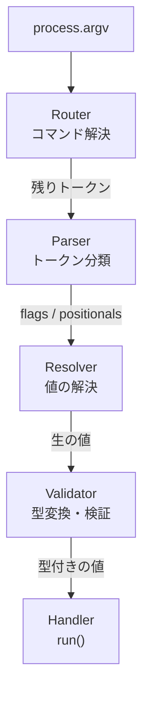
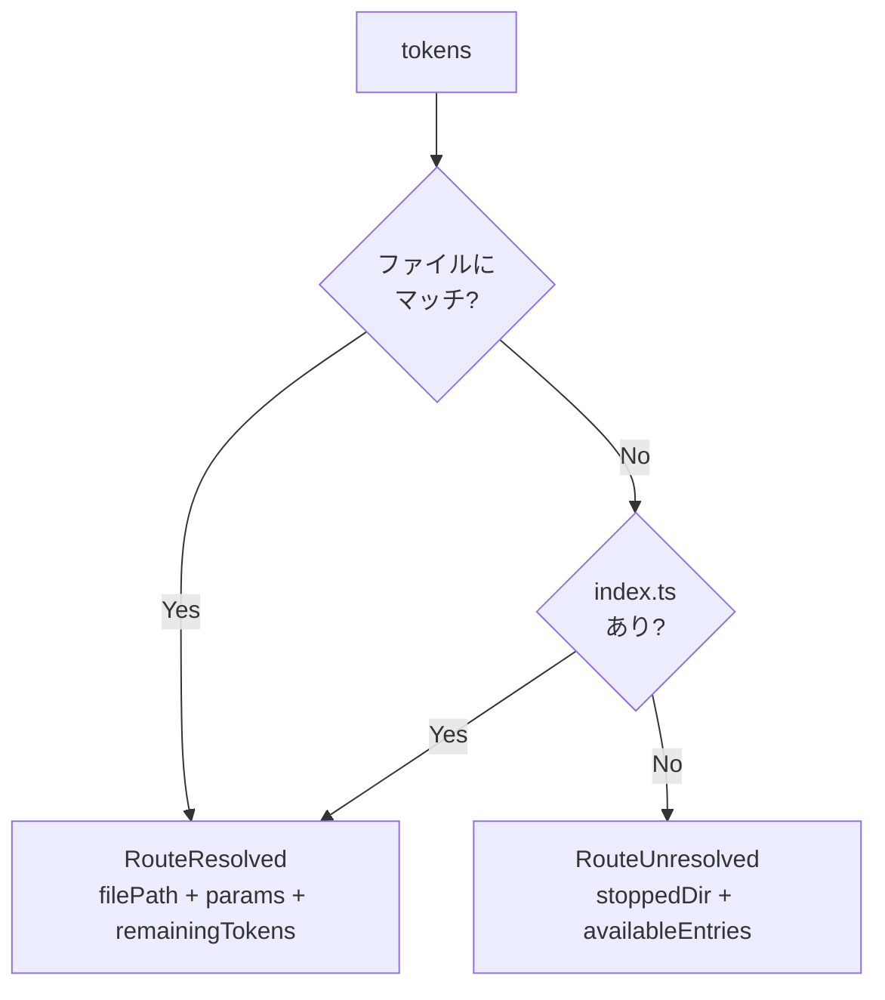
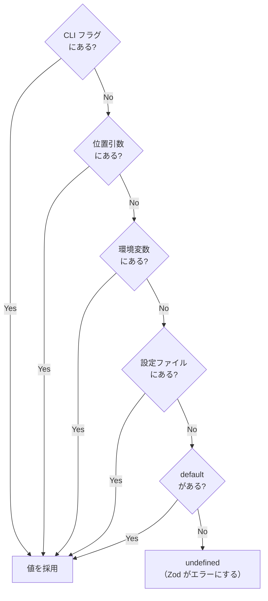

# 内部アーキテクチャ

fsss の内部は **Router → Parser → Resolver → Validator** のパイプラインで構成される。各モジュールは前段の出力だけを受け取り、後段に渡す。



## Router — コマンド解決

`commands/` ディレクトリのファイルシステムを走査し、トークンを消費しながらコマンドファイルを特定する。

### 責務

- トークンを先頭から消費し、ファイル → ディレクトリ → `[param]` の優先順でマッチする
- `-` で始まるトークンに到達した時点でルーティングを停止する
- 動的セグメント `[param]` にマッチしたトークンの値を `params` に収集する
- 消費されなかったトークンを `remainingTokens` として後段に渡す

### 出力の分岐

Router の戻り値はタグ付きユニオン `RouteResolved | RouteUnresolved` になる。



- **Resolved** — コマンドファイルが見つかった。パイプラインの後段へ進む
- **Unresolved** — コマンドが見つからなかった。停止したディレクトリのサブコマンド一覧をヘルプとして表示し、パイプラインはここで終了する

### 走査の例

入力: `["remote", "origin", "push", "--force"]`

| トークン  | ファイルシステムのマッチ                  | 動作                           |
| --------- | ----------------------------------------- | ------------------------------ |
| `remote`  | `commands/remote/` ディレクトリ           | 消費、ディレクトリを掘り進む   |
| `origin`  | `commands/remote/[name]/` 動的セグメント  | 消費、`params.name = "origin"` |
| `push`    | `commands/remote/[name]/push.ts` ファイル | 消費、ルーティング完了         |
| `--force` | —                                         | 残りトークンとして Parser へ   |

## Parser — トークン分類

Router から受け取った残りトークンを、フラグ（`--flag` / `-f`）と位置引数に分類する。

### 責務

- `--flag value`、`--flag=value`、`-f value`、`--no-flag` を処理する
- boolean フラグは値を消費しない（`--verbose` → 文字列 `"true"` を格納）
- `--no-verbose` → 文字列 `"false"` を格納
- エイリアス（`-p` → `port`）を解決する
- `--` 以降のトークンはすべて `doubleDashArgs` に分離する
- **値はすべて生文字列のまま保持する。型変換は行わない**

### boolean フラグの判定

Parser はどのフラグが boolean かを知る必要がある。これは CLI モジュールが args 定義の Zod スキーマを `isBooleanSchema()` で判定し、`ParserConfig.booleanFlags` として Parser に渡す。

boolean フラグでないフラグは次のトークンを値として消費する。boolean フラグは消費しない。この区別がないと `--verbose --port 3000` で `--verbose` が `--port` を値として食べてしまう。

### 出力

```
ParsedTokens {
  flags: Map<string, string[]>   // 名前 → 値の配列（すべて文字列）
  positionals: string[]          // 位置引数（すべて文字列）
  doubleDashArgs: string[]       // -- 以降
}
```

## Resolver — 値の解決

args 定義の各フィールドに対し、複数のソースから値を探索する。最初に見つかった値を採用する。

### 責務

- args 定義を走査し、各フィールドの値をソースの優先順位で解決する
- **値はすべて生のまま渡す。型変換は行わない**

### ソースの優先順位



> [!NOTE]
> CLI フラグと環境変数はどちらも文字列。設定ファイル（JSON）は型を持つ（数値は `number`、真偽値は `boolean`）。default はユーザーが定義した値そのまま。Resolver はこれらの差異を気にせず、見つかった値をそのまま渡す。

## Validator — 型変換・検証

Resolver から受け取った生の値を、Zod スキーマで型変換・バリデーションする。

### 責務

- args 定義の `type` フィールドから `z.object()` を動的に構築する
- 各スキーマを `z.preprocess()` でラップし、文字列→型変換を自動化する
- `schema.parse()` で型変換とバリデーションを同時に行う
- バリデーション失敗時は `ZodError` を throw する（CLI モジュールがキャッチしてヘルプを表示する）

### なぜ z.preprocess() が必要か

CLI フラグと環境変数は**常に文字列**で入ってくる。しかし Zod のスキーマは型に厳格で、`z.boolean()` は文字列 `"true"` を受け付けない。`z.number()` も文字列 `"3000"` を受け付けない。

この変換をユーザーに強制する（`z.coerce` を常に使わせる）のではなく、フレームワーク側で `z.preprocess()` を使って自動的に文字列→型変換を行う。


### 変換ルール

| スキーマの型    | 文字列からの変換                              | 非文字列     |
| --------------- | --------------------------------------------- | ------------ |
| `z.boolean()`   | `"true"` / `"1"` → `true`、それ以外 → `false` | そのまま通す |
| `z.number()`    | `Number()` で変換                             | そのまま通す |
| `z.string()` 等 | ラップしない（変換不要）                      | —            |

> [!NOTE]
> `z.coerce.number()` を使っている場合でも `z.preprocess()` のラップは適用される。`Number("3000")` → `3000` → `z.coerce.number()` が受け取る。coerce は数値をそのまま通すので、冪等であり問題にならない。

## トレース

### `serve -p 3000 -v`

serve コマンド定義: `port` は `z.coerce.number()`、`host` は `z.string()`、`verbose` は `z.boolean()`

| Stage         | 処理                                                                                       | 結果                                                 |
| ------------- | ------------------------------------------------------------------------------------------ | ---------------------------------------------------- |
| **Router**    | `"serve"` → `serve.ts` にマッチ                                                            | remainingTokens: `["-p", "3000", "-v"]`              |
| **Parser**    | `-p` → エイリアス解決 → `port`、`-v` → `verbose`（boolean フラグ）                         | flags: `{port: ["3000"], verbose: ["true"]}`         |
| **Resolver**  | `port`: CLI フラグ `"3000"`、`host`: default `"localhost"`、`verbose`: CLI フラグ `"true"` | `{port: "3000", host: "localhost", verbose: "true"}` |
| **Validator** | `port`: `Number("3000")` → `3000`、`verbose`: `"true" === "true"` → `true`                 | `{port: 3000, host: "localhost", verbose: true}`     |

### `serve -p a3000`（バリデーションエラー）

| Stage         | 処理                                                                          | 結果                                                 |
| ------------- | ----------------------------------------------------------------------------- | ---------------------------------------------------- |
| **Router**    | `"serve"` → `serve.ts` にマッチ                                               | remainingTokens: `["-p", "a3000"]`                   |
| **Parser**    | `-p` → `port`                                                                 | flags: `{port: ["a3000"]}`                           |
| **Resolver**  | `port`: CLI フラグ `"a3000"`、`host`: default、`verbose`: default             | `{port: "a3000", host: "localhost", verbose: false}` |
| **Validator** | `port`: `Number("a3000")` → `NaN` → `z.coerce.number()` が `NaN` をリジェクト | ZodError → stderr にエラー + ヘルプ表示、exit 1      |

### `PORT=9090 serve`（環境変数）

| Stage         | 処理                                           | 結果                                                |
| ------------- | ---------------------------------------------- | --------------------------------------------------- |
| **Router**    | `"serve"` → `serve.ts` にマッチ                | remainingTokens: `[]`                               |
| **Parser**    | トークンなし                                   | flags: `{}`、positionals: `[]`                      |
| **Resolver**  | `port`: CLI フラグなし → env `PORT` = `"9090"` | `{port: "9090", host: "localhost", verbose: false}` |
| **Validator** | `port`: `Number("9090")` → `9090`              | `{port: 9090, host: "localhost", verbose: false}`   |

### `PORT=9090 serve -p 4000`（CLI フラグが環境変数に勝つ）

| Stage         | 処理                                                             | 結果                                                |
| ------------- | ---------------------------------------------------------------- | --------------------------------------------------- |
| **Router**    | `"serve"` → `serve.ts` にマッチ                                  | remainingTokens: `["-p", "4000"]`                   |
| **Parser**    | `-p` → `port`                                                    | flags: `{port: ["4000"]}`                           |
| **Resolver**  | `port`: CLI フラグ `"4000"` が見つかる → env `PORT` は探索しない | `{port: "4000", host: "localhost", verbose: false}` |
| **Validator** | `port`: `Number("4000")` → `4000`                                | `{port: 4000, host: "localhost", verbose: false}`   |

### `remote origin push main --force`（動的セグメント + 位置引数 + フラグ）

| Stage         | 処理                                                             | 結果                                                               |
| ------------- | ---------------------------------------------------------------- | ------------------------------------------------------------------ |
| **Router**    | `"remote"` → dir、`"origin"` → `[name]`、`"push"` → `push.ts`    | params: `{name: "origin"}`、remainingTokens: `["main", "--force"]` |
| **Parser**    | `"main"` → 位置引数、`--force` → boolean フラグ                  | positionals: `["main"]`、flags: `{force: ["true"]}`                |
| **Resolver**  | `branch`: positional `"main"`、`force`: CLI フラグ `"true"`      | `{branch: "main", force: "true"}`                                  |
| **Validator** | `branch`: string そのまま、`force`: `"true" === "true"` → `true` | `{branch: "main", force: true}`                                    |

ハンドラは `params.name`（`"origin"`）と `args.branch`（`"main"`）、`args.force`（`true`）を受け取る。

### `config set foo bar`（位置引数のみ）

| Stage         | 処理                                                         | 結果                              |
| ------------- | ------------------------------------------------------------ | --------------------------------- |
| **Router**    | `"config"` → dir、`"set"` → `set.ts`                         | remainingTokens: `["foo", "bar"]` |
| **Parser**    | 両方とも位置引数                                             | positionals: `["foo", "bar"]`     |
| **Resolver**  | `key`: positional[0] `"foo"`、`value`: positional[1] `"bar"` | `{key: "foo", value: "bar"}`      |
| **Validator** | 両方 string、変換不要                                        | `{key: "foo", value: "bar"}`      |

## エラー時の出力先

| 状況                                         | 出力先 | exit code |
| -------------------------------------------- | ------ | --------- |
| コマンド未指定・未解決（サブコマンド一覧）   | stdout | 0         |
| `--help` / `-h`                              | stdout | 0         |
| バリデーションエラー（型不正・必須引数不足） | stderr | 1         |
